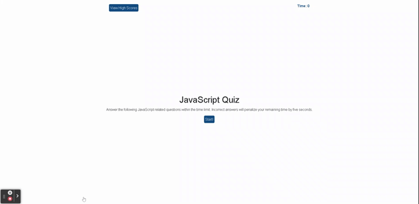

<h1 align="center">Javascript Code Quiz 🚀</h1>

<p align="center">
    
    
    
    

</p>
<p align="center">
    
      
    
</p>

## 📓 Description

A timed coding quiz with multiple-choice questions, built with HTML CSS and
JavaScript.

#### [code-quiz](https://github.com/hugh-bowie/code-quiz.git)

## 🎬 Screenshot



## 🃏 User Story

```
AS A coding boot camp student
I WANT to take a timed quiz on JavaScript fundamentals that stores high scores
SO THAT I can gauge my progress compared to my peers
```

## ✔️ Accpetance Criteria

```
GIVEN I am taking a code quiz
WHEN I click the start button
THEN a timer starts and I am presented with a question
WHEN I answer a question
THEN I am presented with another question
WHEN I answer a question incorrectly
THEN time is subtracted from the clock
WHEN all questions are answered or the timer reaches 0
THEN the game is over
WHEN the game is over
THEN I can save my initials and score
```

## 📋 Table of Contents

- [Description](#description)
- [Screenshot](#Screenshot)
- [User Story](#user-story)
- [Acceptance Criteria](#acceptance-criteria)
- [Table of Contents](#table-of-contents)
- [Installation](#installation)
- [Usage](#usage)
- [Contributing](#contributing)
- [Questions](#questions)

## 🛠 Installation

`git clone https://github.com/hugh-bowie/code-quiz.git`

## ▶️ Useage

`Navigate browser to https://hugh-bowie.github.io/code-quiz/`

## 🍻 Contributing

:octocat: [Hugh Bowie](https://github.com/hugh-bowie)

## ⁉️ Questions

Contact me with any questions:
[hughbowie@me.com](mailto:hughbowie@me.com)<br />[GitHub](https://github.com/hugh-bowie)<br />
